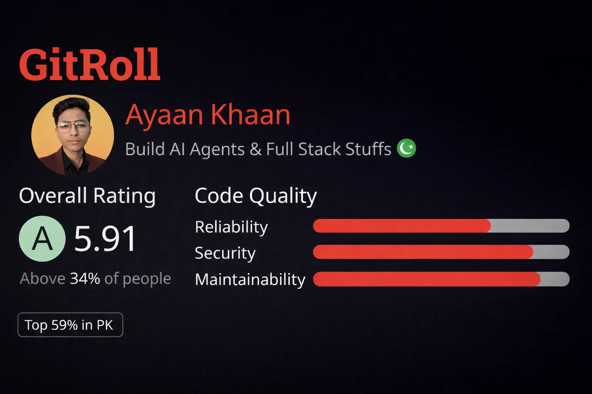
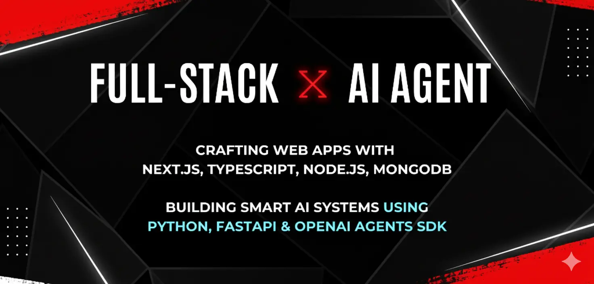
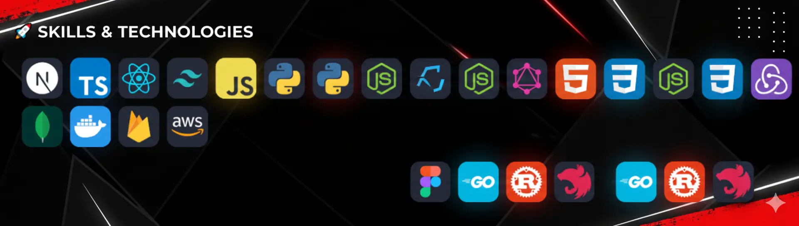

<!-- ===================== MAIN PROFILE BANNER ===================== -->

  

<!-- ===================== FULL STACK BANNER ===================== -->

  

<!-- ===================== SKILLS BANNER ===================== -->

<h1 align="center">Ayaan Ahmed Khan</h1>

  <b>Full-Stack Developer • AI Agent Builder • OpenAI Agents SDK</b>

---

<!-- ===================== SOCIAL LINKS ===================== -->

---

<!-- ===================== SKILLS BANNER ===================== -->

  

## 💻 Tech Stack

---

## ⚡ What I Actually Build

- 💻 Full Stack Systems (**MERN + JAMStack**, **Next.js + FastAPI**)  
- 🤖 Agentic AI Agents (**OpenAI SDK, Agent Builder, n8n**)  
- ⚙️ DevOps & Automation (**AWS, Docker, Kubernetes**)  
- 🧠 Tool-calling, guardrails, hooks, and agent workflows  
- 🏦 Real-world simulations (banking, libraries, process automation)

> ❌ No tutorial junk  
> ❌ No fake buzzwords  
> ✅ Real systems only

## 🌍 Connect With Me

  
  
  
  

---

  <b>Building real systems. Learning fast. No shortcuts.</b> 
  <b>Email: ayanahmed.self@gmail.com</b>

